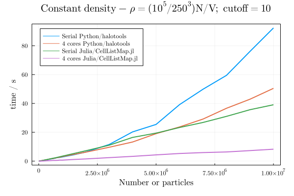

# PairVelocities

Code to compute pairwise velocity distributions for cosmological simulations.

Current benchmarks:

(the Julia test being run here is: https://github.com/m3g/CellListMap.jl/blob/7940ab60f3c3ed2f98c627a184e3a7a255738571/src/examples.jl#L416)

