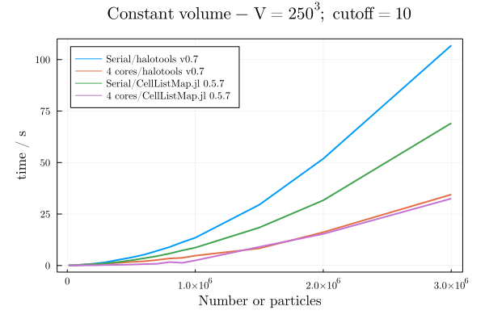
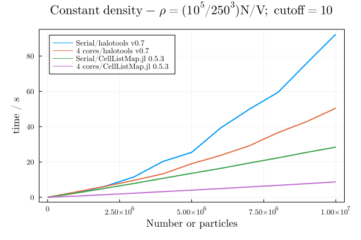

# PairVelocities

Code to compute pairwise velocity distributions for cosmological simulations.

Current benchmarks:

(the Julia test being run here is: https://github.com/m3g/CellListMap.jl/blob/7940ab60f3c3ed2f98c627a184e3a7a255738571/src/examples.jl#L416)

### Version 0.8.27-DEV

Obs: The comoputer used in this benchmark is different from previous ones.

### Version 0.5.11

### Version 0.5.7

### Version 0.5.4

### Version 0.5.3

### Version 0.5.2

### Version 0.4.8

### Version 0.4.7

### Version 0.4.6

### Version 0.4.5

### Version 0.4.3

